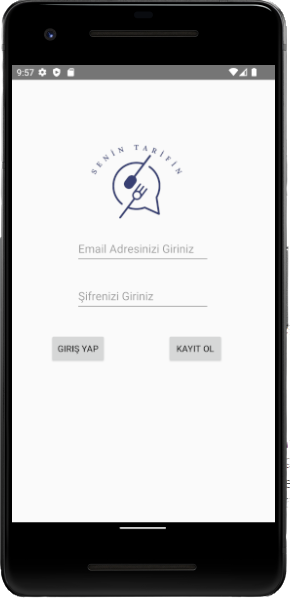

e# Kotlin - Recipes App
- The purpose of this application is to provide a place where people can share their own recipes. In this way, since each shared recipe is displayed in a common area, other users can also have an idea about the recipes.
- I used Firebase in the application.

## Pages
- <a href ='#Login Page'> Login Page </a>
- <a href ='#Share Recipe Page'> Share Recipe Page </a>
- <a href ='#Recipes Page'> Recipes Page </a>

### Login Page
- It is the page that allows users to log in and register to the application.

### Share Recipe Page
- It is the page where the recipe and image of the dish that the user wants to share are added.

### Recipes Page
- This is the page where all the shared recipes are listed. The description of the user in each name that adds it is listed.

